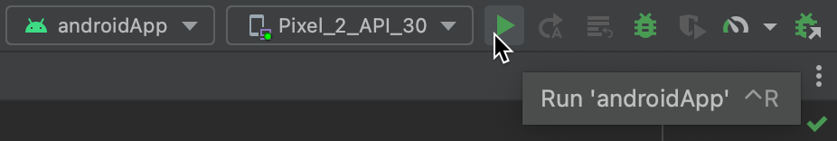

# Gobblet Gobblers Game

This is a simple implementation of the Gobblet Gobblers game using Compose Multiplatform.
Currently, it supports Android and Desktop.

> **Warning**
> This game is still in development.

## Build With

* [Compose Multiplatform](https://github.com/JetBrains/compose-multiplatform)
* [MVVM](https://en.wikipedia.org/wiki/Model%E2%80%93view%E2%80%93viewmodel) is an architectural pattern in computer software that facilitates the separation of the development of the graphical user interface.

## Local Development

## Run your application

### On desktop

To run your desktop application in Android Studio, select `desktopApp` in the list of run configurations and click **Run**:

 

You can also run Gradle tasks in the terminal:

* `./gradlew run` to run application
* `./gradlew package` to store native distribution into `build/compose/binaries`

### On Android

To run your application on an Android emulator:

1. Ensure you have an Android virtual device available.
   Otherwise, [create one](https://developer.android.com/studio/run/managing-avds#createavd).
2. In the list of run configurations, select `androidApp`.
3. Choose your virtual device and click **Run**:

     

  
Alternatively, use Gradle

To install an Android application on a real Android device or an emulator, run `./gradlew installDebug` in the terminal.

## Credits

Thanks to [Robin Schäfer](https://github.com/RobinSchfr/) for the [Tier Images](https://github.com/RobinSchfr/Gobblet-Gobblers-Game)